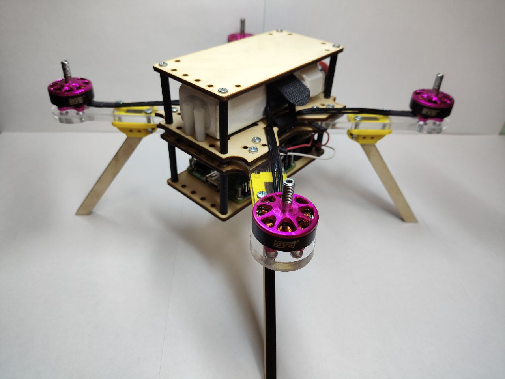

# Квадрокоптер с автономной посадкой

Репозиторий проекта по созданию квадрокоптера, способного к автономной посадке на заданную посадочную площадку с использованием компьютерного зрения.

## 🎯 Цель проекта

Разработать беспилотный летательный аппарат (квадрокоптер), способный совершать **автономную посадку в заданную область размерами 30х30 см с точностью до 15 см** (от центра зоны до центра квадрокоптера).

## 📋 Основные характеристики

- **Точность посадки:** ≤ 15 см
- **Размер посадочной зоны:** 30 × 30 см
- **Дальность до зоны посадки:** 2 м (от точки взлета)
- **Время полета:** ~10 минут
- **Габариты коптера:** 20 × 20 см

## 🛠️ Функциональность

- Автоматический взлет и полет к зоне посадки
- Реализация алгоритма компьютерного зрения для идентификации и наведения на посадочную метку
- **Автономное выполнение точного посадочного маневра**
- Ручное управление (резервный режим)

## 🏗️ Архитектура и основные компоненты

### Аппаратное обеспечение

| Компонент                 | Модель / Описание                       |
| ------------------------- | --------------------------------------- |
| **Рама**                  | 20×20 см, изготовлена на Физтех Фабрике |
| **Двигатели**             | Бесколлекторные моторы DYS 2306 1750KV  |
| **Полетный контроллер**   | Skystars F4 (стек FC + ESC)             |
| **Аккумулятор**           | LiPo 3S 3000mAh                         |
| **Микрокомпьютер**        | Raspberry Pi 3 Model A+                 |
| **Камера**                | Модуль камеры Raspberry Pi 5MP OV5647   |
| **Аппаратура управления** | Flysky FS-i6 (2.4 ГГц)                  |
| **Пропеллеры**            | 5×4.5, изготовлены на Физтех Фабрике    |

### Программное обеспечение

- **Прошивка полетного контроллера:** ArduPilot / Betaflight
- **Логика автономности:** Python
- **Компьютерное зрение:** Библиотека **OpenCV** (Python)
- **Взаимодействие:** Связь между Raspberry Pi и полетным контроллером (по UART)

## 🚀 Этапы разработки

- [x] Проектирование и изготовление рамы
- [x] Заказ и подбор комплектующих
- [x] Физическая сборка квадрокоптера
- [x] Настройка полетного контроллера и тесты ручного управления
- [x] Изучение OpenCV и разработка алгоритма детектирования посадочной зоны
- [x] Интеграция компьютерного зрения с системой управления
- [ ] Тестирование и отладка автономного полета и посадки
- [x] Финальные испытания и демонстрация

## 🔄 Аналоги и вдохновение

- **ArduPilot:** Открытая платформа с поддержкой точной посадки по визуальным маркерам
- **Airobotics:** Промышленные решения для автономных дронов
- **Open-source DIY проекты:** Реализации автономных дронов на Raspberry Pi и OpenCV

## Результаты

В результате работы над проектом был спроектирован и собран квадрокоптер, способный к пилотированию путем ручного управления, с системой компьютерного зрения.

Чего не удалось достичь: в силу нерабочих компонентов, а именно полетного контроллера Pixhawk 2.4.8, стало затруднительным
имплементировать систему компьютерного зрения для ее изначального назначения: координировать квадрокоптер для совершения
автономной посадки в область назначения.

## 👨‍💻 Команда

- **Анатолий Рогов** (B01-406) - [rogov.ai@phystech.edu](mailto:rogov.ai@phystech.edu)
- **Михаил Мовсесян** (B01-403) - [moveseian.me@phystech.edu](mailto:moveseian.me@phystech.edu)

**Учебный проект в рамках "Практикума цифрового производства". Осень 2025.**

---

**Связаться с командой:** [Telegram-канал](https://t.me/still_landing) | **Исходный код:** [GitHub](https://github.com/TolikRogov/DPP-Project)
